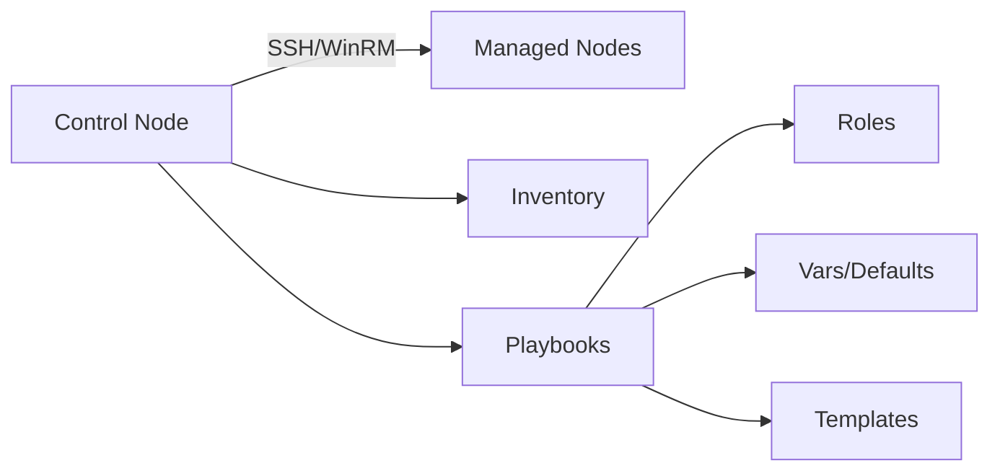

# Ansible Mastery (Mid to Senior)

## What and Why
- Ansible is an agentless automation engine for configuration management, application deployment, and orchestration.
- In interviews, you need to show correctness, idempotence, and operational thinking (safe changes, blast radius, rollback).

## Mental Model
- Control node executes tasks against managed nodes over SSH or WinRM.
- Inventory defines scope, variables define intent, playbooks define desired state.
- Roles package reusable logic.



## Core Theory (Only What Matters)
- Idempotence: tasks should converge to a desired state without unintended changes.
- Inventory: static (INI/YAML) or dynamic (cloud API); groups drive targeting.
- Variables: precedence rules matter; avoid surprises with explicit scopes.
- Roles: reusable, testable structure; use `defaults/`, `vars/`, `tasks/`, `handlers/`.
- Handlers: run once when notified; great for service restarts.
- Vault: encrypt secrets; prefer per-env vault files and CI secret injection.
- Execution strategy: `serial`, `max_fail_percentage`, `strategy: free` for rollout control.

## Practical Commands and Examples
- Inventory and ad-hoc:
```bash
ansible -i inventory.ini all -m ping
ansible -i inventory.ini web -m shell -a "uptime"
ansible-inventory -i inventory.ini --graph
```
- Playbook run with limits, check mode, and diff:
```bash
ansible-playbook -i inventory.ini site.yml --limit web --check --diff
```
- Example play with idempotent package and template:
```yaml
- name: Configure web
  hosts: web
  become: true
  tasks:
    - name: Install nginx
      ansible.builtin.apt:
        name: nginx
        state: present
        update_cache: true

    - name: Render nginx config
      ansible.builtin.template:
        src: nginx.conf.j2
        dest: /etc/nginx/nginx.conf
      notify: Restart nginx

  handlers:
    - name: Restart nginx
      ansible.builtin.service:
        name: nginx
        state: restarted
```

## Common Pitfalls and Troubleshooting
- Variable precedence surprises: document and keep overrides minimal.
- `shell` or `command` used where an idempotent module exists.
- Missing `become` or incorrect privilege escalation.
- Large blast radius: missing `--limit`, no `serial`, no canary.
- Dynamic inventory failures: cache issues or missing credentials.

## Interview Talking Points
- How you design a role structure and keep it testable.
- Strategies to avoid downtime (serial, handlers, canaries).
- How you handle secrets (Vault + CI).
- Debugging plan for failed tasks and drift.
- Idempotence and why it matters for safe re-runs.

## Study Path
- Beginner: inventory, ad-hoc, playbooks, modules, vars.
- Intermediate: roles, handlers, templates, vault, check mode.
- Advanced: dynamic inventory, execution strategy, performance tuning, rollback patterns.