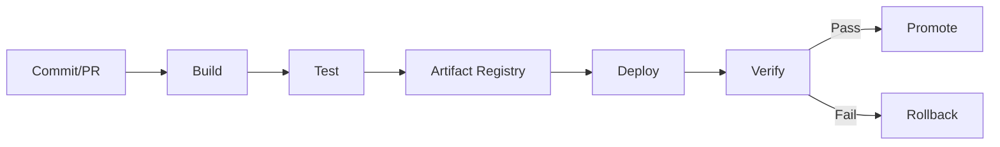

# CI/CD Mastery (Mid to Senior)

## What and Why
- CI/CD is the control plane for safe, fast software delivery.
- Interviews focus on safety, automation, rollback strategy, and evidence-based release control.

## Mental Model
- Code change becomes a tested, immutable artifact, then safely promoted across environments.



## Core Theory (Only What Matters)
- Immutability: build once, deploy many.
- Gates: tests, security scans, approvals at risk boundaries.
- Environments: dev, staging, prod with clear promotion rules.
- Deployment strategies: rolling, blue/green, canary, feature flags.
- Traceability: every deploy must map to commit, build, and artifact.

## Practical Commands and Examples
- GitHub Actions minimal CI:
```yaml
name: CI
on: [push, pull_request]
jobs:
  test:
    runs-on: ubuntu-latest
    steps:
      - uses: actions/checkout@v4
      - uses: actions/setup-node@v4
        with: { node-version: "20" }
      - run: npm ci
      - run: npm test
```

- Jenkinsfile minimal pipeline:
```groovy
pipeline {
  agent any
  stages {
    stage('Build') { steps { sh 'npm ci' } }
    stage('Test') { steps { sh 'npm test' } }
  }
}
```

- ArgoCD app sync:
```bash
argocd app sync my-app --prune
argocd app wait my-app --health
```

## Common Pitfalls and Troubleshooting
- Rebuilding in each environment (breaks immutability).
- Secrets in logs or pipeline variables.
- No rollback path or no automated health verification.
- Overly broad deploy permissions in CI.
- Flaky tests blocking releases without triage workflow.

## Interview Talking Points
- How you design a safe promotion workflow with approvals.
- Artifact immutability and provenance.
- Handling flaky tests and partial failures.
- Release strategies and rollback decision rules.
- Security gates without destroying delivery velocity.

## Study Path
- Beginner: CI basics, build/test, basic deploy.
- Intermediate: artifacts, gates, secrets, environment promotions.
- Advanced: canary/blue-green, GitOps, policy-as-code, supply chain security.