# CI/CD Pipeline Diagrams

## 1. Basic CI/CD Pipeline Flow

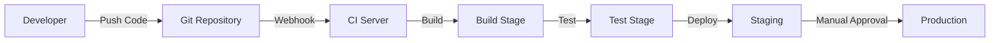

## 2. Complete CI/CD Pipeline with Stages

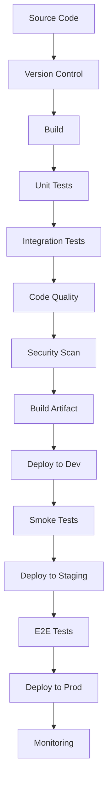

## 3. GitLab CI/CD Pipeline

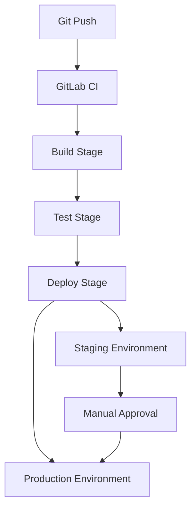

## 4. Jenkins Pipeline Stages

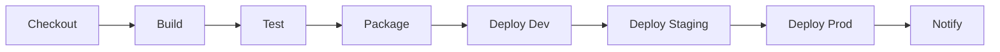

## 5. GitHub Actions Workflow

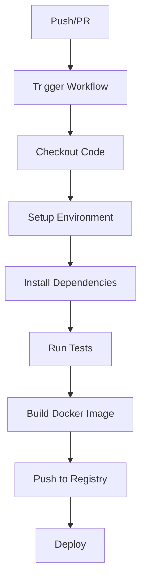

## 6. Multi-Environment Deployment Pipeline

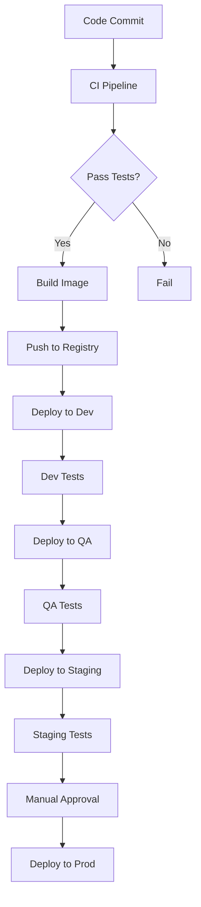

## 7. Blue-Green Deployment Pipeline

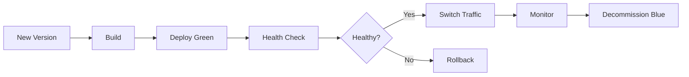

## 8. Canary Deployment Pipeline

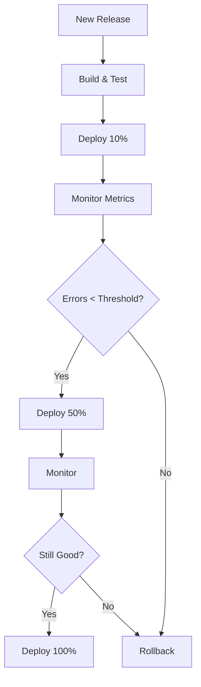

## 9. CI/CD with Docker

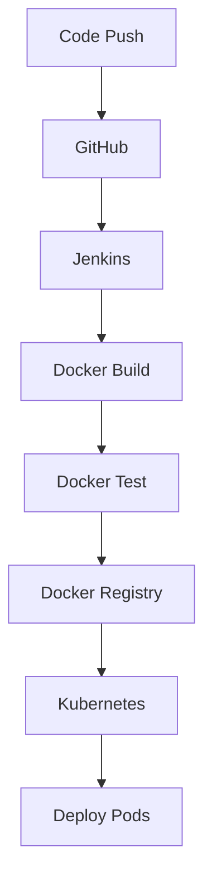

## 10. CI/CD Security Pipeline

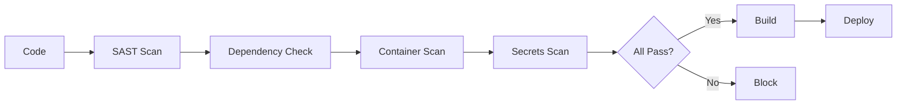

## 11. ArgoCD GitOps Flow

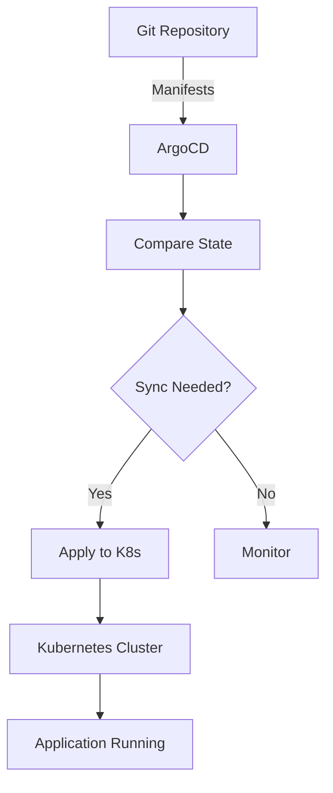

## 12. Multi-Branch Pipeline Strategy

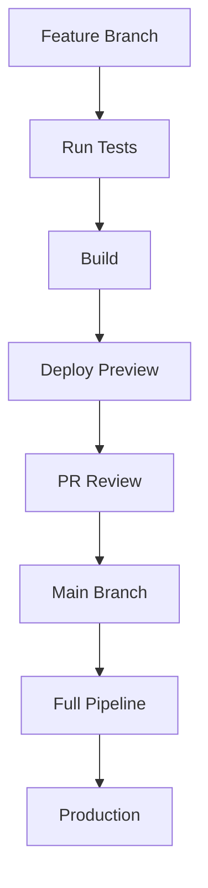

