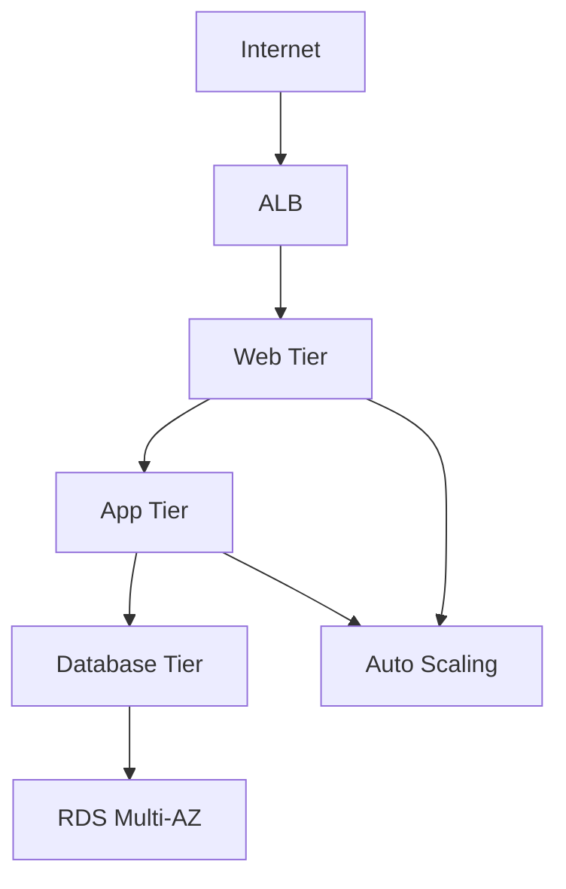
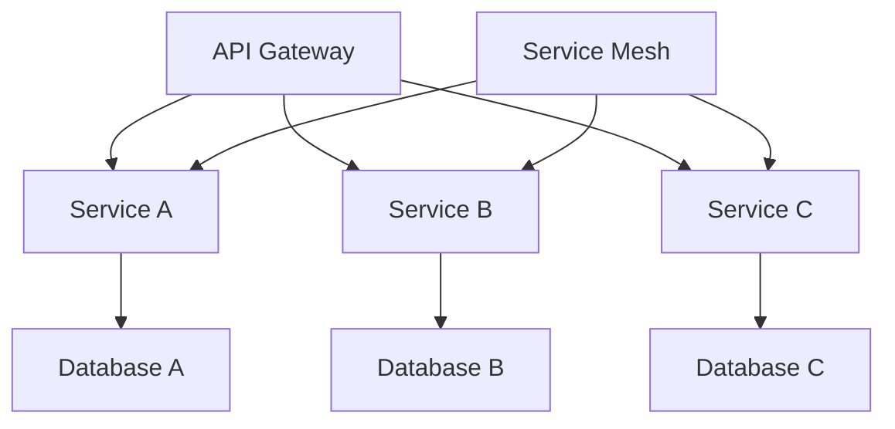
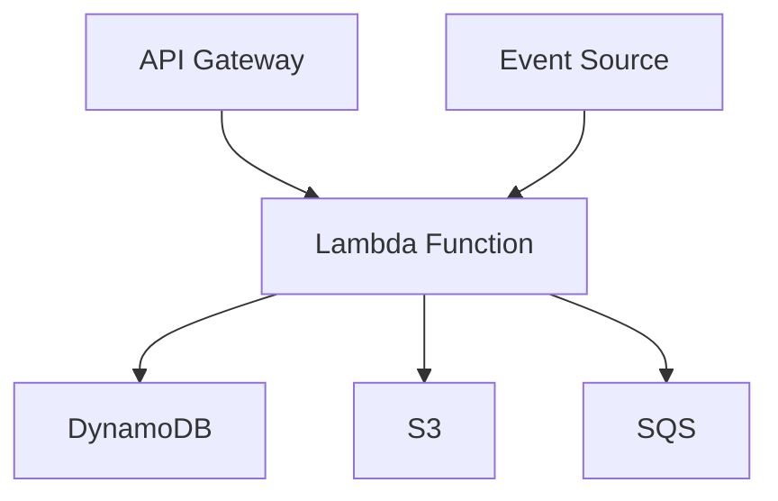
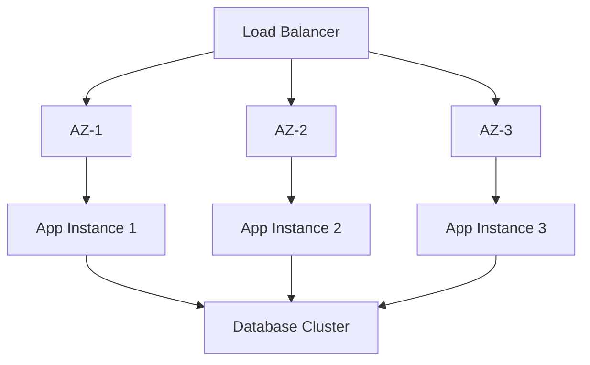
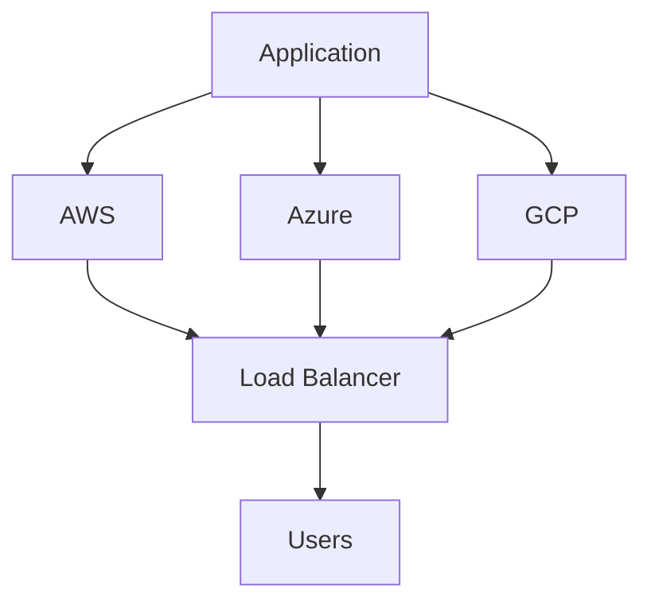
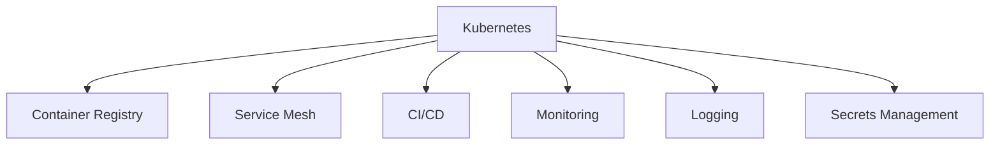

# Cloud Architecture Diagrams

## 55. AWS Three-Tier Architecture

## 56. Microservices Architecture

## 57. Serverless Architecture

## 58. High Availability Architecture

## 59. Multi-Cloud Strategy

## 60. Cloud Native Architecture

