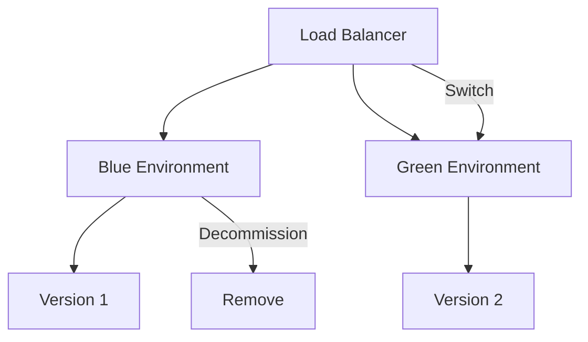
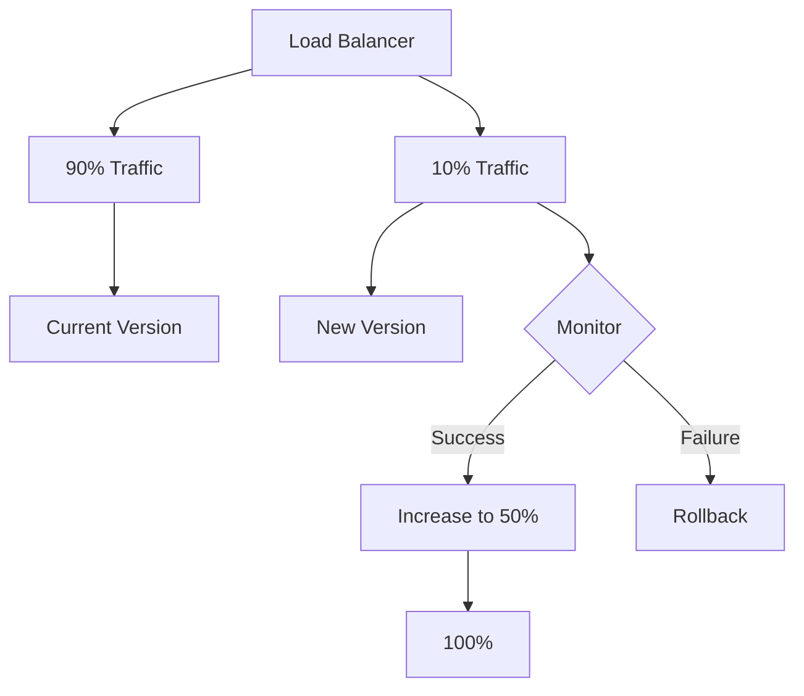
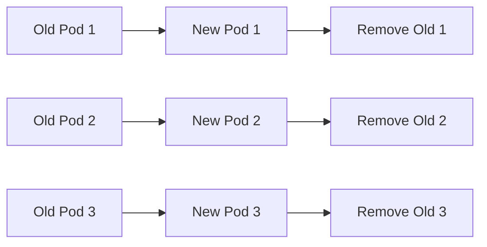
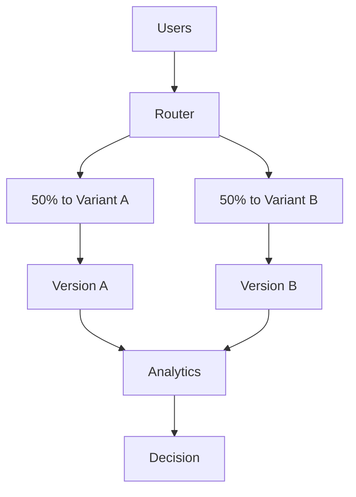
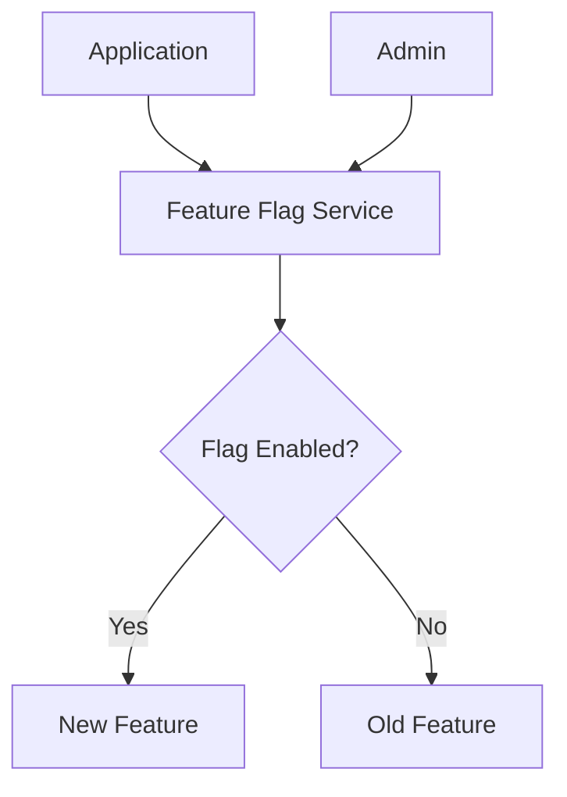

# Deployment Strategy Diagrams

## 71. Blue-Green Deployment

```mermaid
graph TB
    A[Load Balancer] --> B[Blue Environment]
    A --> C[Green Environment]
    B --> D[Version 1]
    C --> E[Version 2]
    A -->|Switch| C
    B -->|Decommission| F[Remove]
```

## 72. Canary Deployment

```mermaid
graph TB
    A[Load Balancer] --> B[90% Traffic]
    A --> C[10% Traffic]
    B --> D[Current Version]
    C --> E[New Version]
    C --> F{Monitor}
    F -->|Success| G[Increase to 50%]
    F -->|Failure| H[Rollback]
    G --> I[100%]
```

## 73. Rolling Deployment

```mermaid
graph LR
    A[Old Pod 1] --> B[New Pod 1]
    C[Old Pod 2] --> D[New Pod 2]
    E[Old Pod 3] --> F[New Pod 3]
    B --> G[Remove Old 1]
    D --> H[Remove Old 2]
    F --> I[Remove Old 3]
```

## 74. A/B Testing Deployment

```mermaid
graph TB
    A[Users] --> B[Router]
    B --> C[50% to Variant A]
    B --> D[50% to Variant B]
    C --> E[Version A]
    D --> F[Version B]
    E --> G[Analytics]
    F --> G
    G --> H[Decision]
```

## 75. Feature Flag Deployment

```mermaid
graph TB
    A[Application] --> B[Feature Flag Service]
    B --> C{Flag Enabled?}
    C -->|Yes| D[New Feature]
    C -->|No| E[Old Feature]
    F[Admin] --> B
```

