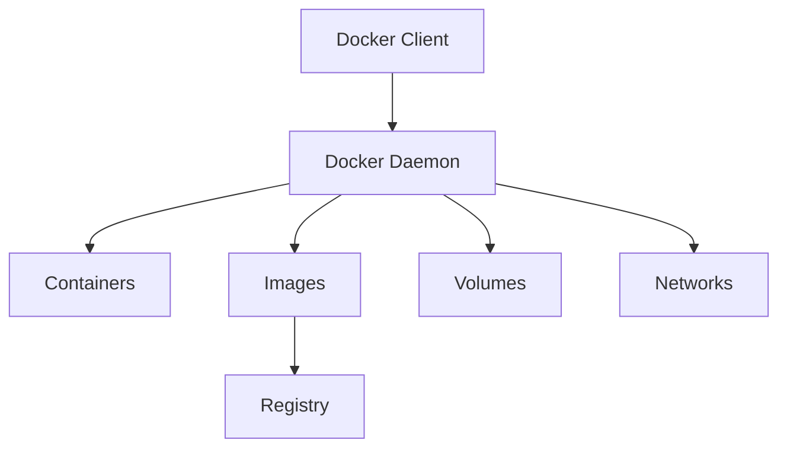
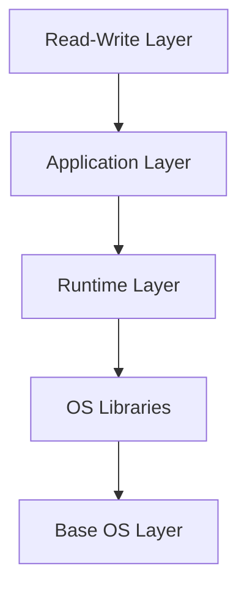
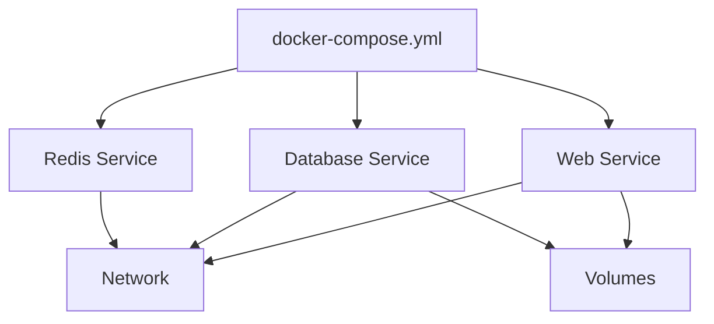
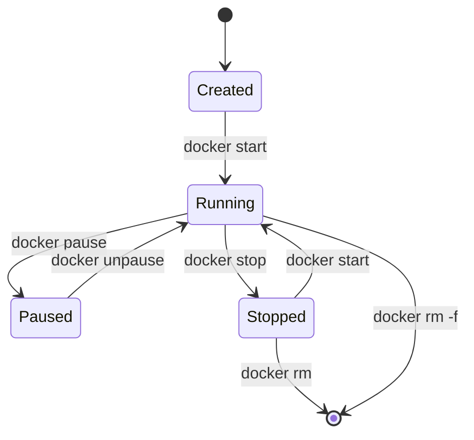
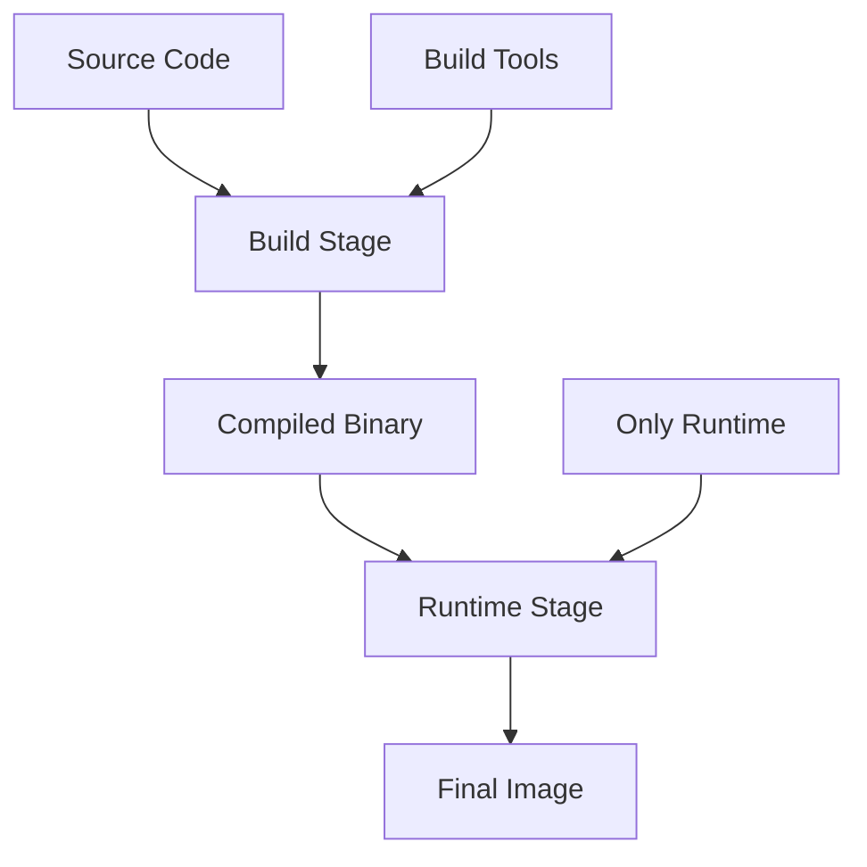
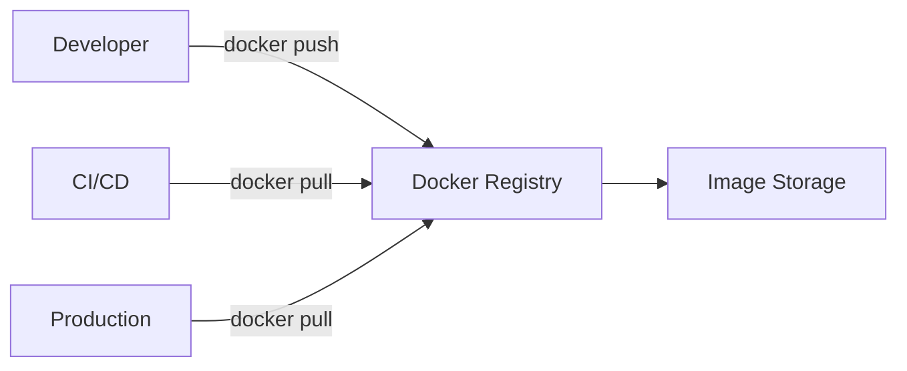
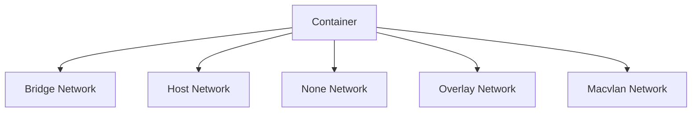
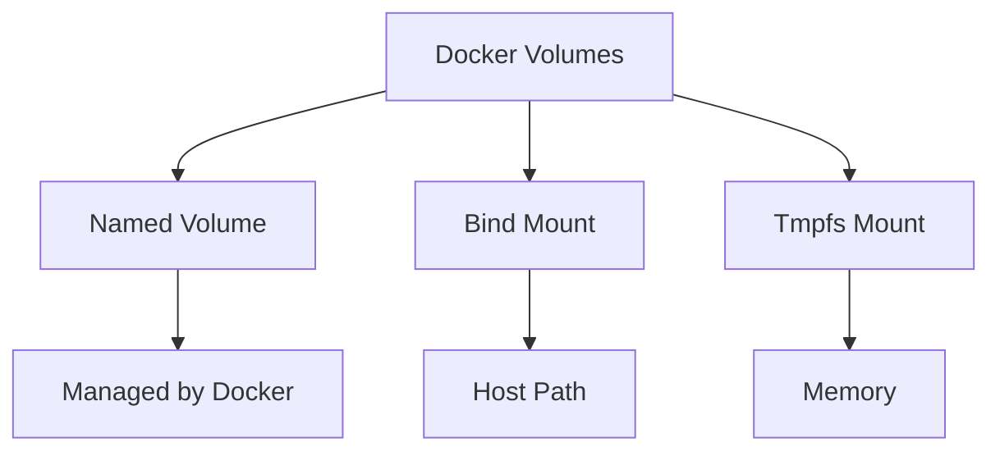

# Docker and Containerization Diagrams

## 27. Docker Architecture

## 28. Docker Image Layers

## 29. Docker Compose Architecture

## 30. Container Lifecycle

## 31. Multi-Stage Docker Build

## 32. Docker Registry Flow

## 33. Container Networking Modes

## 34. Docker Volume Types

