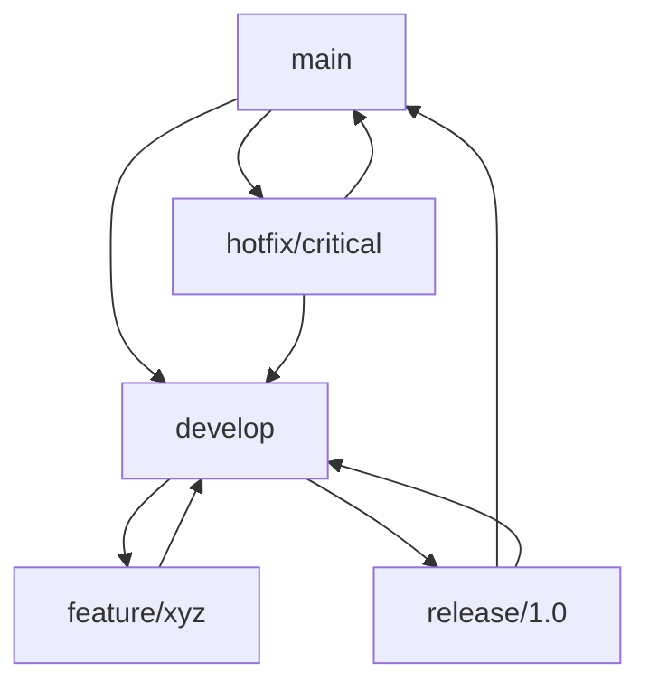
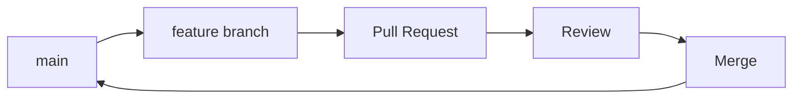
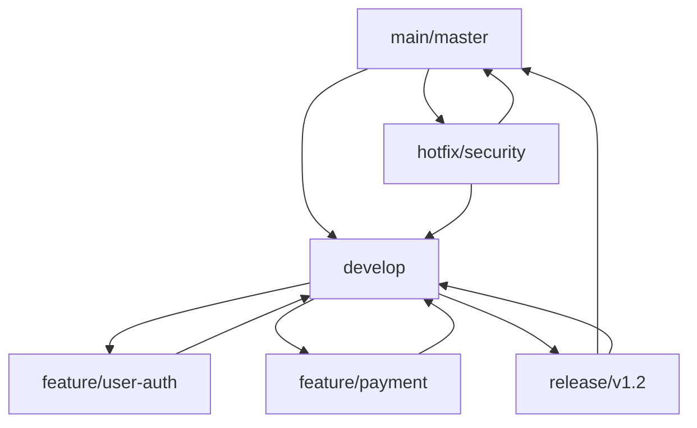
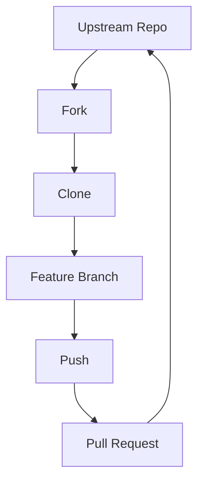
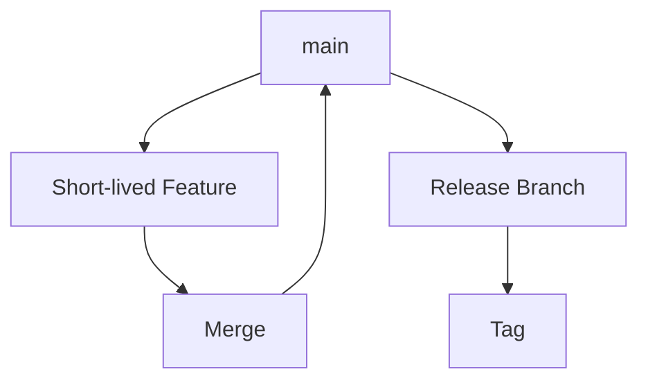

# Git Workflow Diagrams

## 61. GitFlow Workflow

```mermaid
graph TB
    A[main] --> B[develop]
    B --> C[feature/xyz]
    B --> D[release/1.0]
    A --> E[hotfix/critical]
    C --> B
    D --> A
    D --> B
    E --> A
    E --> B
```

## 62. GitHub Flow

```mermaid
graph LR
    A[main] --> B[feature branch]
    B --> C[Pull Request]
    C --> D[Review]
    D --> E[Merge]
    E --> A
```

## 63. Git Branching Strategy

```mermaid
graph TB
    A[main/master] --> B[develop]
    B --> C[feature/user-auth]
    B --> D[feature/payment]
    B --> E[release/v1.2]
    A --> F[hotfix/security]
    C --> B
    D --> B
    E --> A
    E --> B
    F --> A
    F --> B
```

## 64. Forking Workflow

```mermaid
graph TB
    A[Upstream Repo] --> B[Fork]
    B --> C[Clone]
    C --> D[Feature Branch]
    D --> E[Push]
    E --> F[Pull Request]
    F --> A
```

## 65. Trunk-Based Development

```mermaid
graph TB
    A[main] --> B[Short-lived Feature]
    B --> C[Merge]
    C --> A
    A --> D[Release Branch]
    D --> E[Tag]
```

