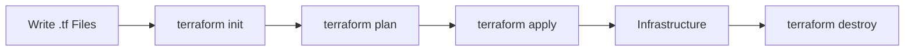
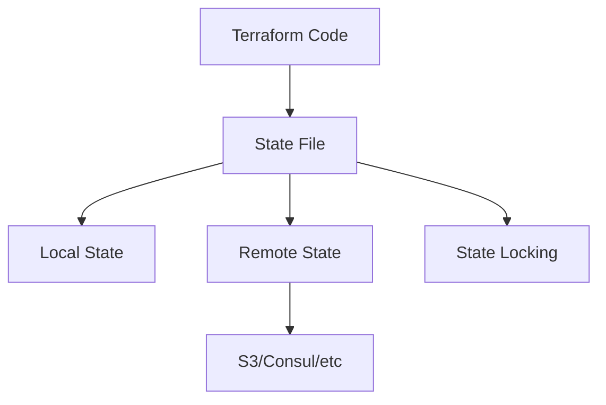
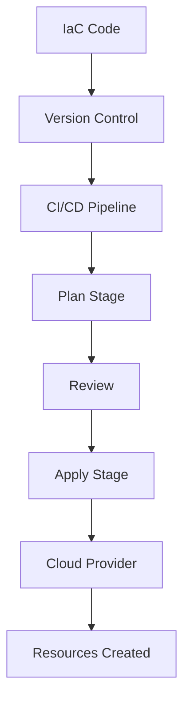
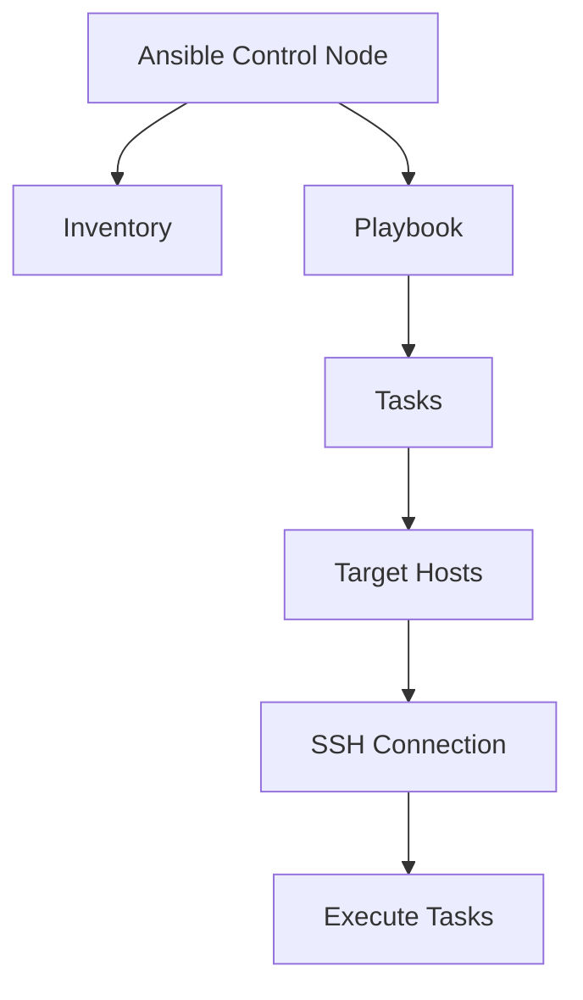
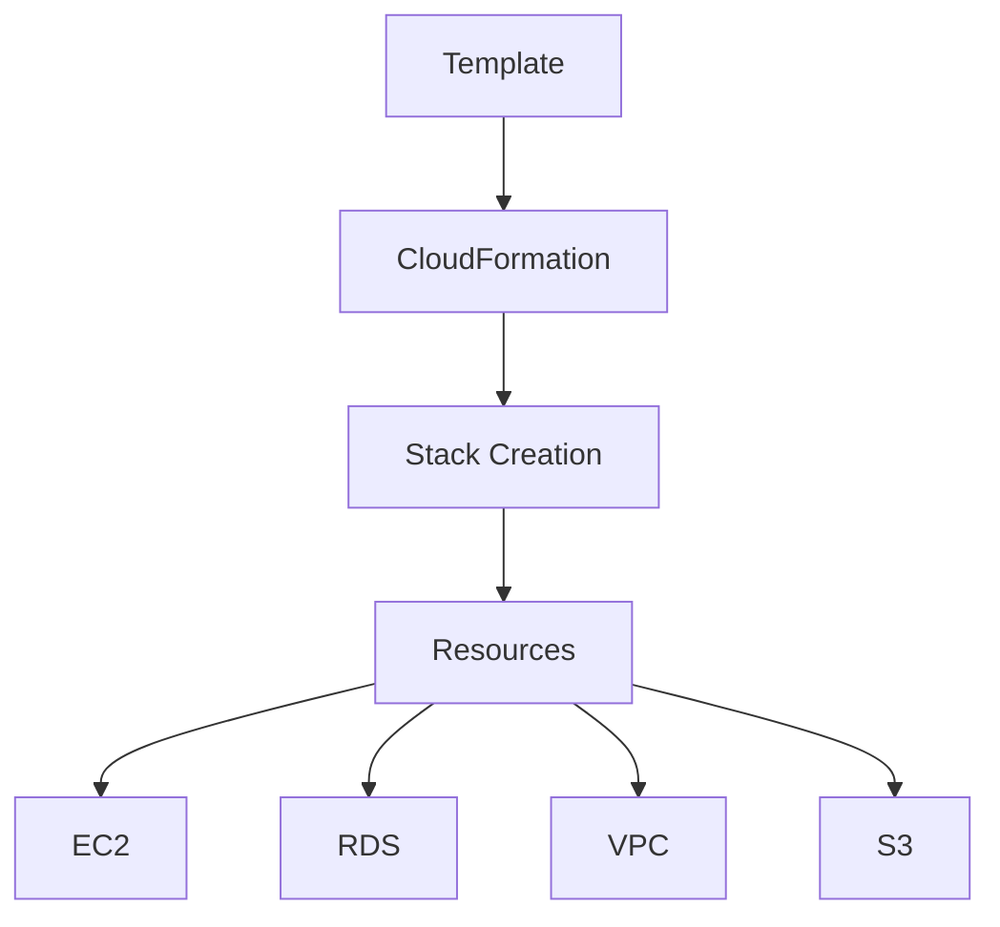
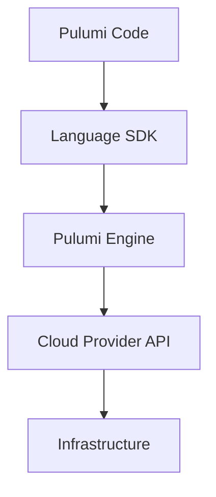
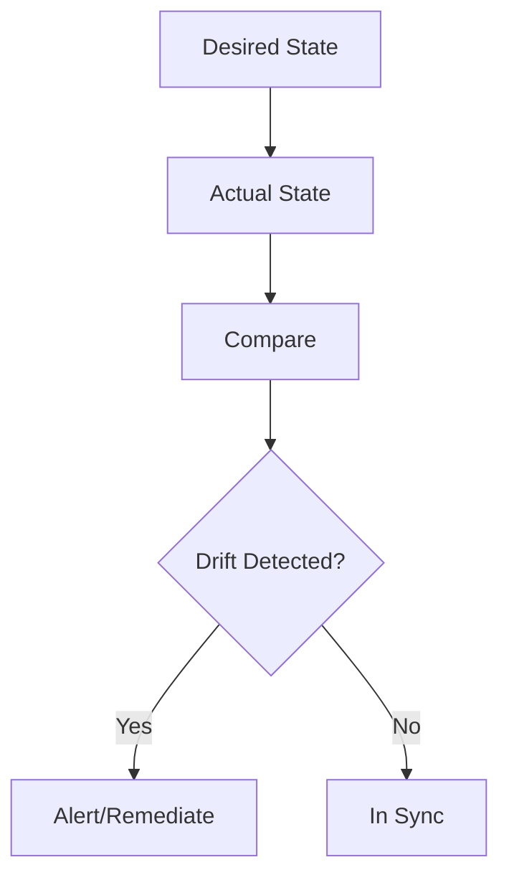

# Infrastructure as Code Diagrams

## 35. Terraform Workflow

## 36. Terraform State Management

## 37. Infrastructure Provisioning Flow

## 38. Ansible Playbook Execution

## 39. CloudFormation Stack

## 40. Pulumi Architecture

## 41. Infrastructure Drift Detection

