# Kubernetes Architecture Diagrams

## 13. Kubernetes Cluster Architecture

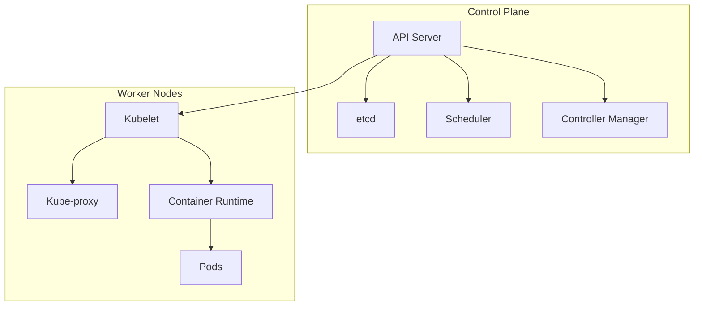

## 14. Pod Lifecycle

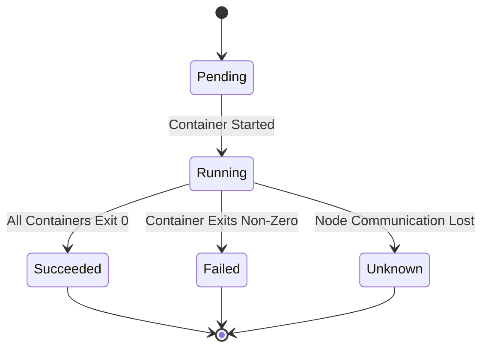

## 15. Kubernetes Service Types

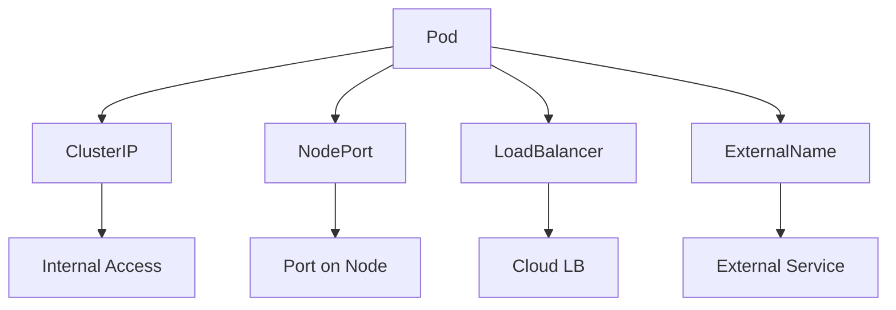

## 16. Deployment Strategy - Rolling Update

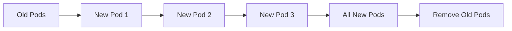

## 17. Kubernetes Ingress Flow

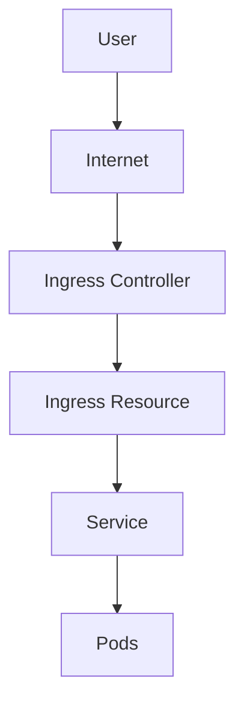

## 18. ConfigMap and Secret Usage

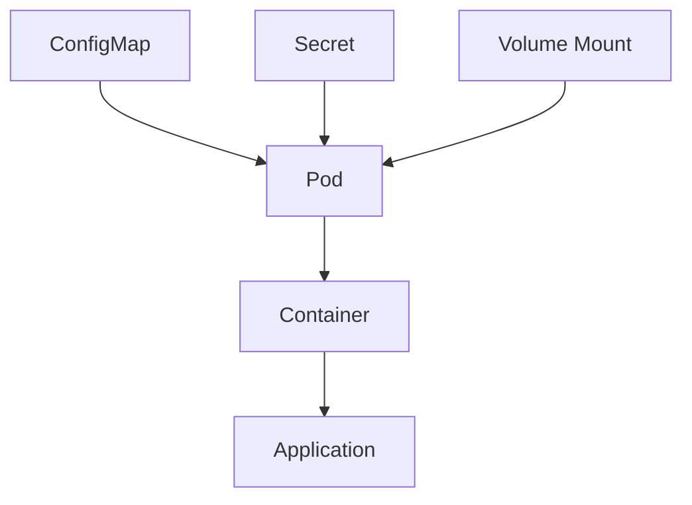

## 19. Horizontal Pod Autoscaler

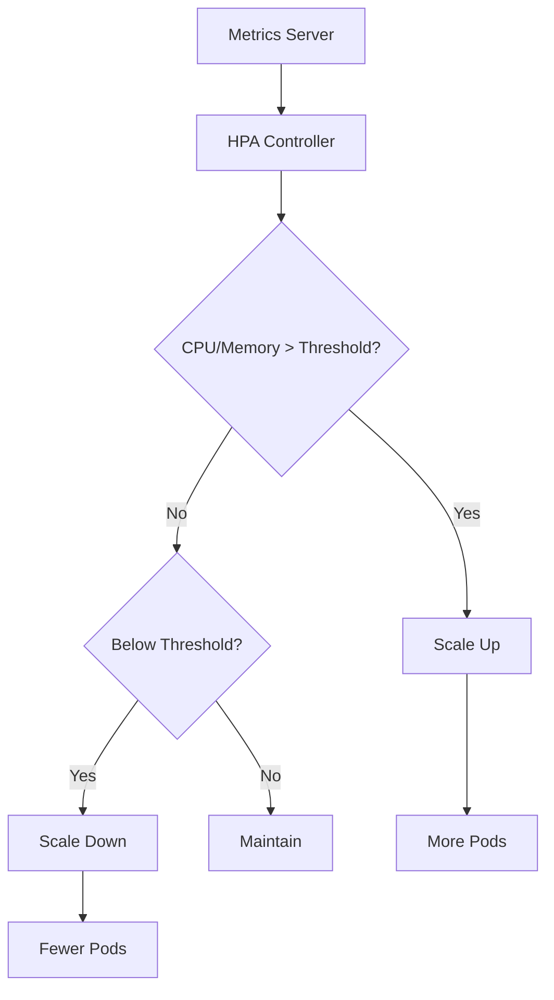

## 20. Kubernetes Namespace Isolation

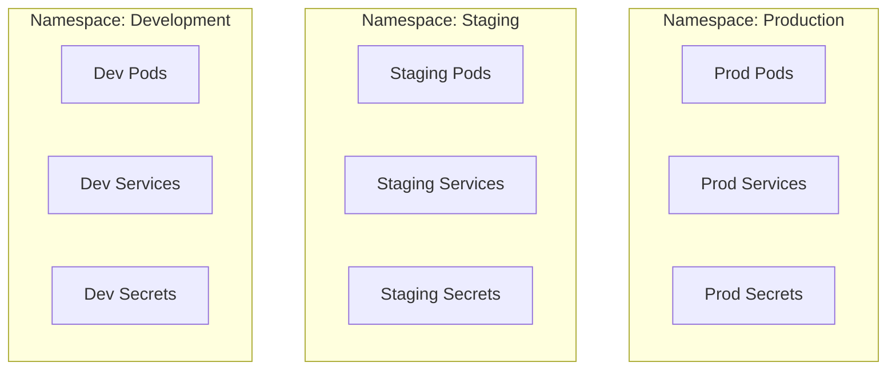

## 21. StatefulSet Architecture

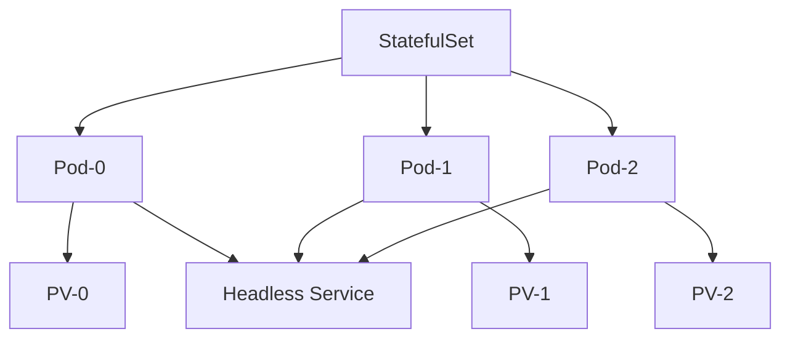

## 22. DaemonSet Architecture

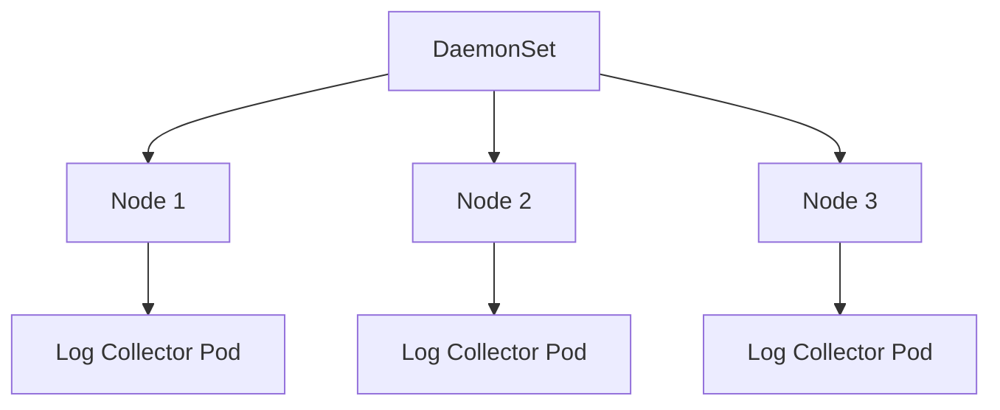

## 23. Kubernetes Networking Model

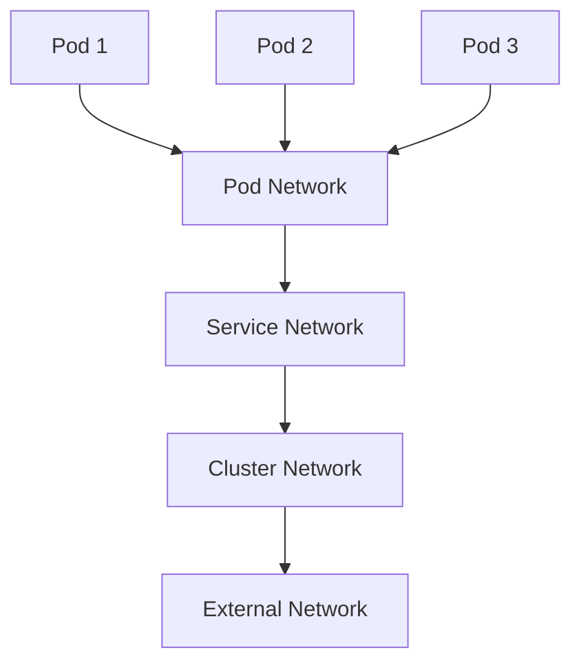

## 24. Persistent Volume Lifecycle

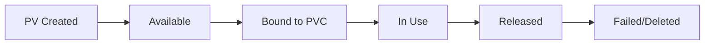

## 25. Kubernetes RBAC Flow

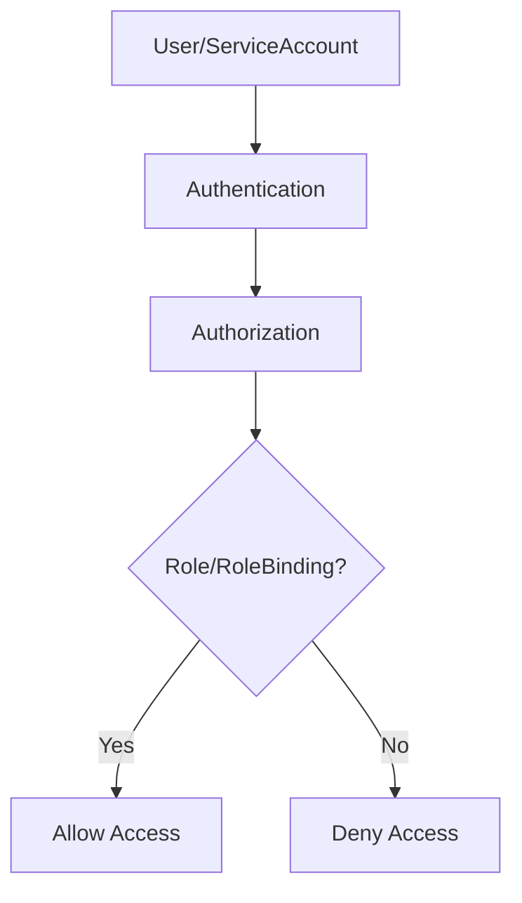

## 26. Helm Chart Architecture

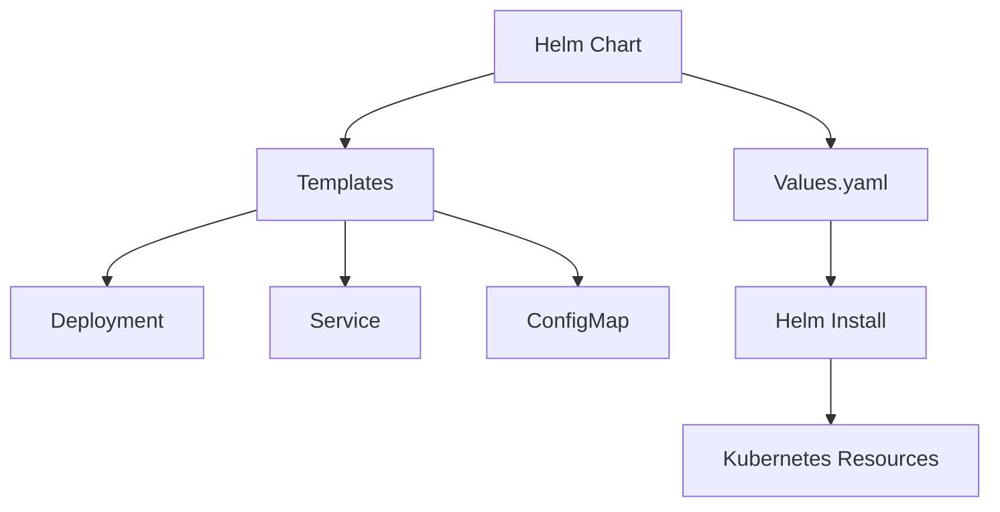

