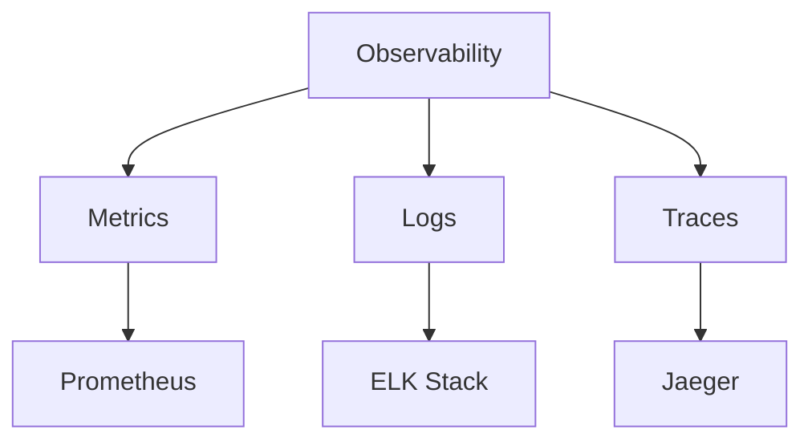
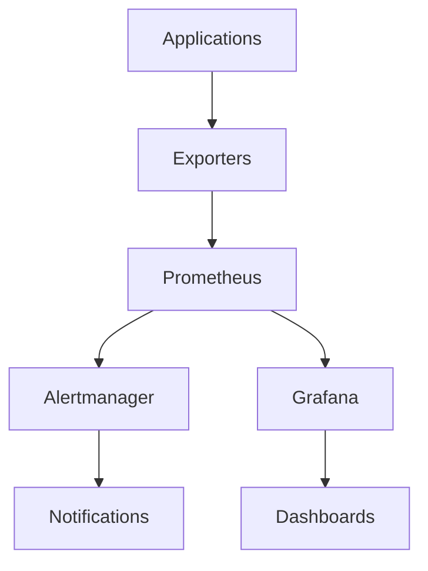
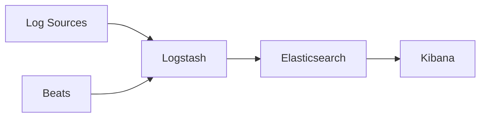
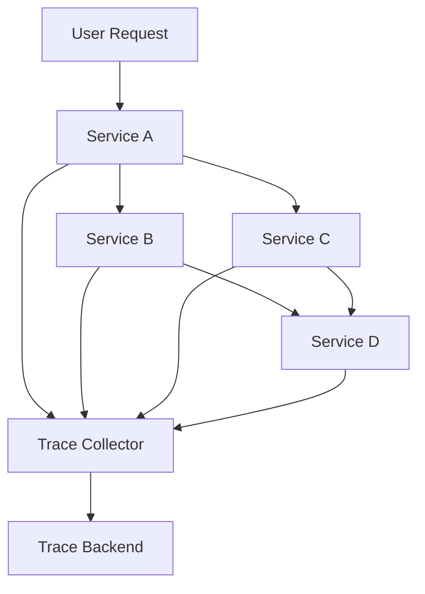
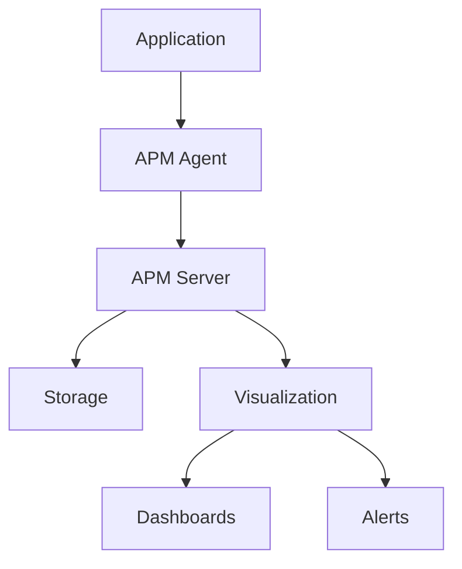
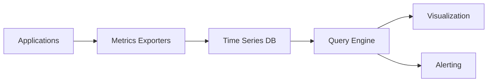
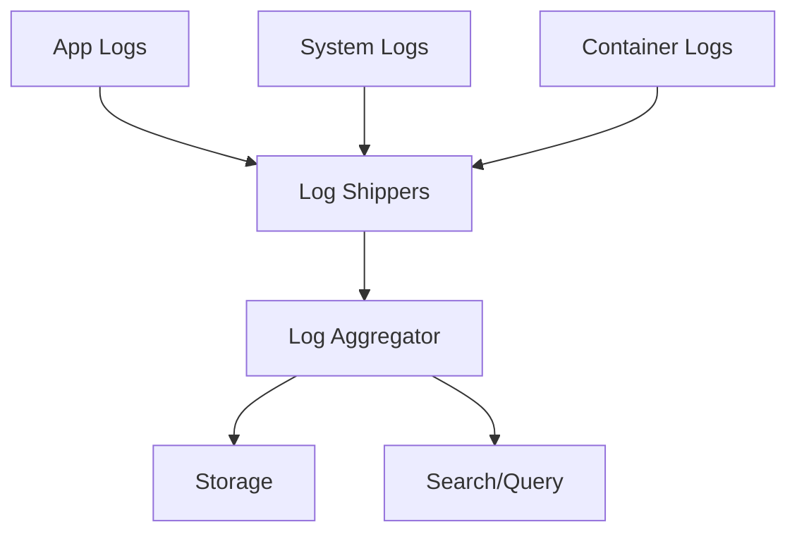

# Monitoring and Observability Diagrams

## 42. Three Pillars of Observability

## 43. Prometheus Monitoring Stack

## 44. ELK Stack Architecture

## 45. Distributed Tracing Flow

## 46. APM Architecture

## 47. Metrics Collection Pipeline

## 48. Log Aggregation Architecture

