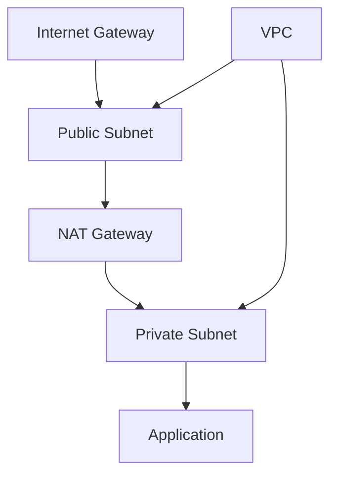
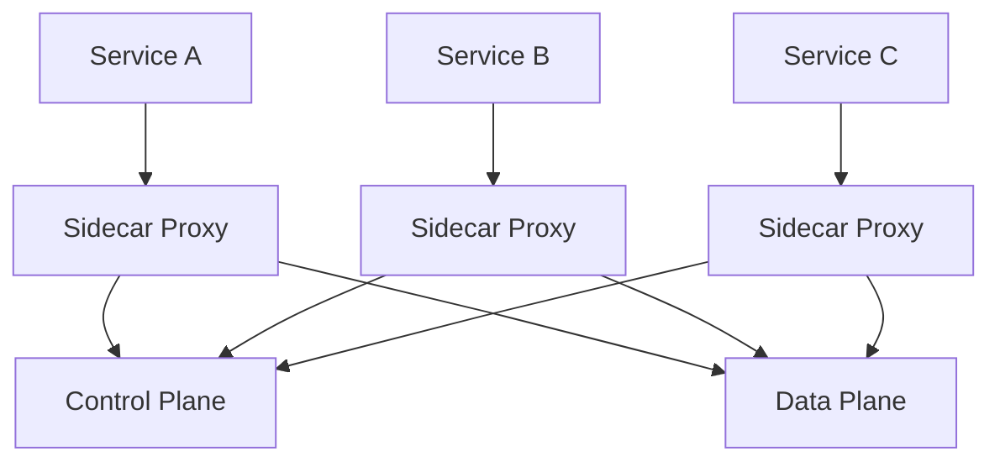
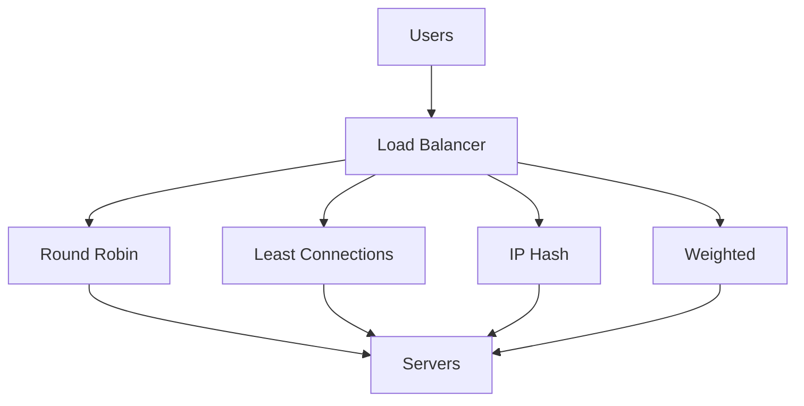
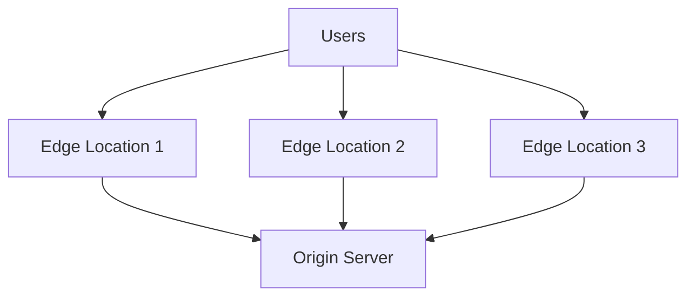
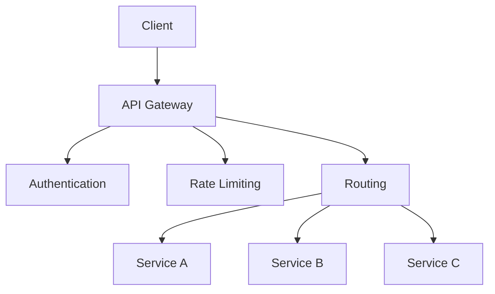

# Networking Architecture Diagrams

## 66. VPC Architecture

```mermaid
graph TB
    A[Internet Gateway] --> B[Public Subnet]
    B --> C[NAT Gateway]
    C --> D[Private Subnet]
    D --> E[Application]
    F[VPC] --> B
    F --> D
```

## 67. Service Mesh Architecture

```mermaid
graph TB
    A[Service A] --> B[Sidecar Proxy]
    C[Service B] --> D[Sidecar Proxy]
    E[Service C] --> F[Sidecar Proxy]
    B --> G[Control Plane]
    D --> G
    F --> G
    B --> H[Data Plane]
    D --> H
    F --> H
```

## 68. Load Balancing Strategies

```mermaid
graph TB
    A[Users] --> B[Load Balancer]
    B --> C[Round Robin]
    B --> D[Least Connections]
    B --> E[IP Hash]
    B --> F[Weighted]
    C --> G[Servers]
    D --> G
    E --> G
    F --> G
```

## 69. CDN Architecture

```mermaid
graph TB
    A[Users] --> B[Edge Location 1]
    A --> C[Edge Location 2]
    A --> D[Edge Location 3]
    B --> E[Origin Server]
    C --> E
    D --> E
```

## 70. API Gateway Pattern

```mermaid
graph TB
    A[Client] --> B[API Gateway]
    B --> C[Authentication]
    B --> D[Rate Limiting]
    B --> E[Routing]
    E --> F[Service A]
    E --> G[Service B]
    E --> H[Service C]
```

