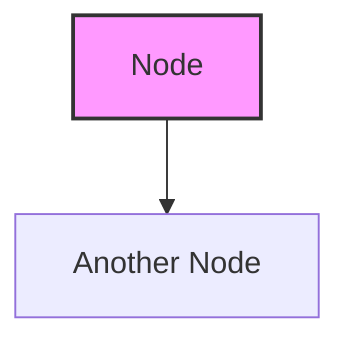

# DevOps Diagrams Collection

This directory contains **75+ Mermaid diagrams** covering various DevOps concepts, architectures, and workflows.

## 📊 Diagram Categories

### 1. CI/CD Diagrams (12 diagrams)
- Basic CI/CD pipelines
- GitLab CI/CD, Jenkins, GitHub Actions
- Multi-environment deployments
- Blue-Green and Canary deployments
- Security pipelines
- GitOps workflows

### 2. Kubernetes Diagrams (14 diagrams)
- Cluster architecture
- Pod lifecycle
- Service types
- Ingress, ConfigMaps, Secrets
- HPA, StatefulSets, DaemonSets
- Networking, RBAC, Helm

### 3. Docker Diagrams (8 diagrams)
- Docker architecture
- Image layers
- Docker Compose
- Container lifecycle
- Multi-stage builds
- Networking and volumes

### 4. Infrastructure Diagrams (7 diagrams)
- Terraform workflows
- Ansible execution
- CloudFormation
- Pulumi
- Infrastructure drift

### 5. Monitoring Diagrams (7 diagrams)
- Observability pillars
- Prometheus stack
- ELK stack
- Distributed tracing
- APM and metrics

### 6. Security Diagrams (6 diagrams)
- DevSecOps pipeline
- Zero Trust
- Security scanning layers
- Secrets management
- Container security

### 7. Cloud Architecture Diagrams (6 diagrams)
- AWS three-tier
- Microservices
- Serverless
- High availability
- Multi-cloud
- Cloud native

### 8. Git Workflow Diagrams (5 diagrams)
- GitFlow
- GitHub Flow
- Branching strategies
- Forking workflow
- Trunk-based development

### 9. Networking Diagrams (5 diagrams)
- VPC architecture
- Service mesh
- Load balancing
- CDN
- API Gateway

### 10. Deployment Strategy Diagrams (5 diagrams)
- Blue-Green
- Canary
- Rolling
- A/B Testing
- Feature flags

## 🚀 How to View These Diagrams

### Option 1: VS Code Extensions

Install one of these VS Code extensions:

1. **Markdown Preview Mermaid Support**
   - Extension ID: `bierner.markdown-mermaid`
   - Open any `.md` file and use the preview

2. **Mermaid Preview**
   - Extension ID: `vstirbu.vscode-mermaid-preview`
   - Right-click on `.md` files → "Open Preview"

3. **Mermaid Editor**
   - Extension ID: `tomoyukim.vscode-mermaid-editor`
   - Dedicated Mermaid editor

### Option 2: Online Viewers

- [Mermaid Live Editor](https://mermaid.live/)
- Copy the diagram code and paste it

### Option 3: GitHub/GitLab

- These diagrams render automatically on GitHub and GitLab

## 📁 File Structure

```
DevOps-Diagrams/
├── README.md
├── CI-CD-Diagrams.md
├── Kubernetes-Diagrams.md
├── Docker-Diagrams.md
├── Infrastructure-Diagrams.md
├── Monitoring-Diagrams.md
├── Security-Diagrams.md
├── Cloud-Architecture-Diagrams.md
├── Git-Workflow-Diagrams.md
├── Networking-Diagrams.md
└── Deployment-Strategy-Diagrams.md
```

## 🎯 Usage Tips

1. **View in VS Code**: Install the Mermaid extension and use Markdown preview
2. **Customize**: Edit the Mermaid code to modify diagrams
3. **Export**: Use online tools to export as PNG/SVG
4. **Learn**: Study the diagrams to understand DevOps concepts visually

## 🔧 Customizing Diagrams

All diagrams use Mermaid syntax. You can:
- Modify colors and styles
- Add/remove nodes
- Change layouts (TB, LR, etc.)
- Add interactions

Example:


## 📚 Mermaid Documentation

- [Mermaid Documentation](https://mermaid.js.org/)
- [Mermaid Live Editor](https://mermaid.live/)
- [Mermaid Syntax Guide](https://mermaid.js.org/intro/syntax-reference.html)

---

**Total Diagrams: 75+**

Enjoy exploring DevOps concepts through visual diagrams! 🎨

