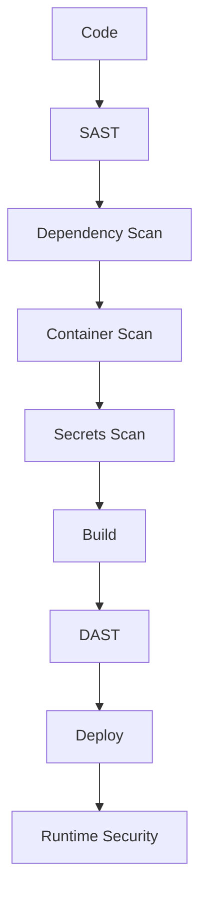
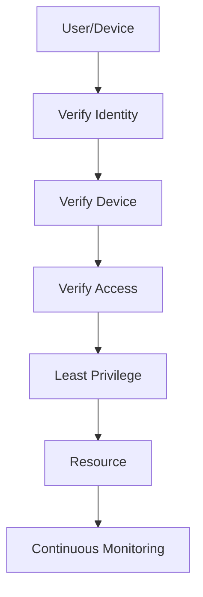
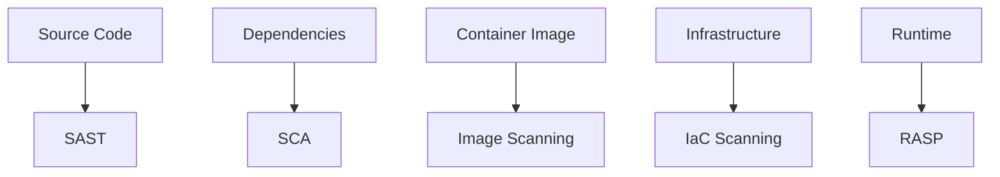
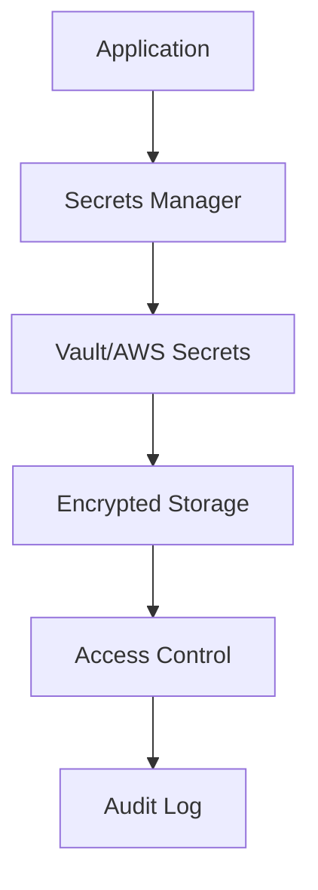
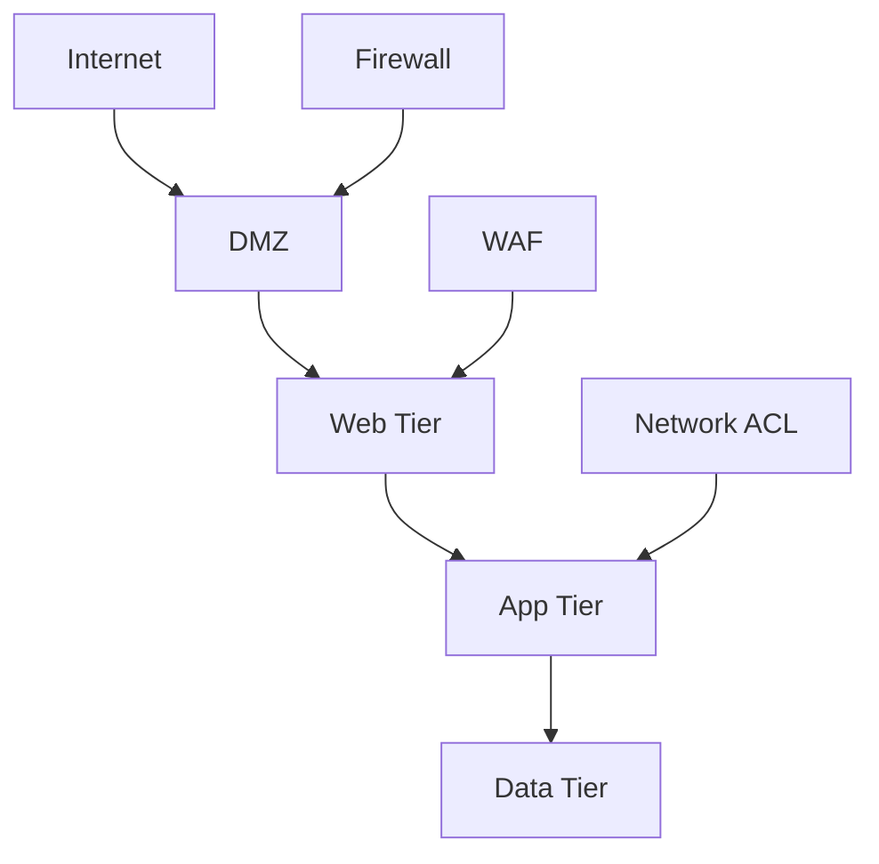
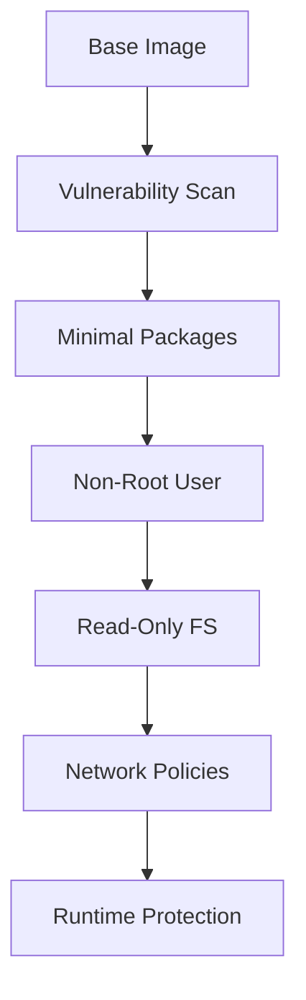

# Security and DevSecOps Diagrams

## 49. DevSecOps Pipeline

## 50. Zero Trust Architecture

## 51. Security Scanning Layers

## 52. Secrets Management Flow

## 53. Network Security Zones

## 54. Container Security Layers

