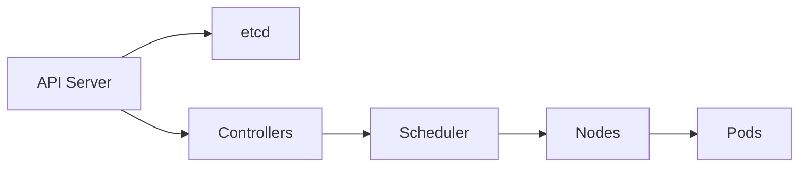

# Kubernetes Interview Mastery (Mid to Senior)

## What and Why
- Kubernetes is the control plane for modern infrastructure. Interviewers want proof you can operate it safely under load.
- Focus on correctness, reliability, and predictable rollouts.

## Mental Model
- API server stores desired state; controllers reconcile actual state; nodes run workloads.



## Core Theory (Only What Matters)
- Desired state reconciliation via controllers.
- Scheduling constraints: resources, taints, affinity, topology.
- Deployment strategies: rolling, canary, blue/green using labels and traffic control.
- Probes: readiness gates traffic, liveness restarts, startup protects slow boot.
- Safety controls: PDBs, resource limits, RBAC, namespaces.

## Practical Commands and Examples
- Triage basics:
```bash
kubectl get pods -A
kubectl describe pod <pod>
kubectl logs <pod> --previous
kubectl top nodes
```

- Rollout control:
```bash
kubectl rollout status deploy/myapp
kubectl rollout undo deploy/myapp
```

- PDB example:
```yaml
apiVersion: policy/v1
kind: PodDisruptionBudget
metadata:
  name: app-pdb
spec:
  minAvailable: 2
  selector:
    matchLabels:
      app: myapp
```

## Common Pitfalls and Troubleshooting
- Probes configured to kill healthy pods.
- No resource requests leads to noisy neighbor failures.
- Missing PDBs causes outages during node drains.
- Incorrect image tags and missing registry access.
- Manual kubectl changes causing drift from GitOps.

## Interview Talking Points
- How you do safe rollouts with PDBs and readiness probes.
- How you diagnose CrashLoopBackOff and Pending pods.
- How you design namespaces and RBAC for multi-team clusters.
- How you control blast radius and enable rollback.

## Study Path
- Beginner: pods, deployments, services, logs.
- Intermediate: probes, scheduling, storage, networking.
- Advanced: multi-cluster, policy, autoscaling, GitOps.