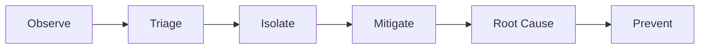

# DevOps Troubleshooting (Mid to Senior)

## What and Why
- Troubleshooting is the core on-call skill: identify, isolate, mitigate, and prevent recurrence.
- Interviews focus on how you think under pressure, prioritize impact, and avoid making things worse.

## Mental Model
- Use a repeatable loop: observe -> narrow scope -> isolate -> mitigate -> fix -> prevent.



## Core Theory (Only What Matters)
- Start with impact and blast radius, not guesses.
- Prefer reversible changes first (traffic shifts, feature flags, scaling).
- Always validate with metrics, logs, and traces, not only anecdotes.
- Capture time, hypotheses, actions, and results for postmortem.

## Practical Commands and Examples
- System triage:
```bash
uptime
free -m
df -h
ps aux --sort=-%cpu | head
journalctl -xe
```

- Network basics:
```bash
ss -tulpn
lsof -i :443
curl -sS -D - https://example.com/healthz
traceroute example.com
```

- Kubernetes:
```bash
kubectl get pods -A
kubectl describe pod <pod>
kubectl logs <pod> --previous
kubectl top nodes
```

## Common Pitfalls and Troubleshooting
- Fixing symptoms without understanding scope or impact.
- Making multiple changes at once, losing causality.
- Skipping rollback or making irreversible changes.
- Ignoring recent changes, feature flags, or deploy history.
- Not communicating status to stakeholders.

## Interview Talking Points
- Your default incident workflow and how you keep it safe.
- How you decide between rollback vs forward fix.
- How you validate a fix and avoid recurrence.
- How you handle partial failures and time pressure.

## Study Path
- Beginner: Linux triage, logs, basic networking.
- Intermediate: k8s debugging, CI failures, performance analysis.
- Advanced: multi-service incidents, dependency failures, postmortem quality.